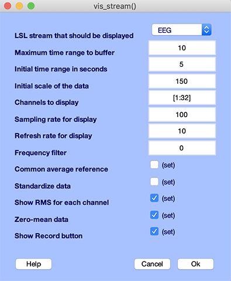
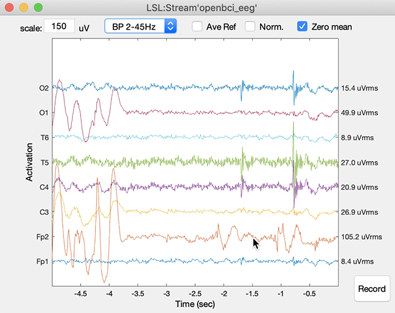
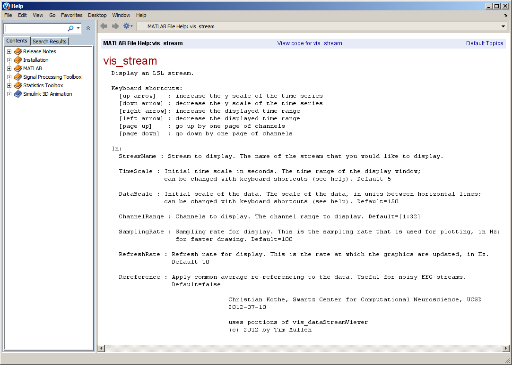

# Overview

This LSL viewer can be used with MATLAB, as well as EEGLAB, or it can be used without MATLAB in its compiled version. When used without MATLAB, you do not need a MATLAB license, as it is completely standalone.

The MATLAB Viewer is a MATLAB function (vis\_stream) that is included with the full LSL distribution. It allows you to view the signal content of any stream on your lab network in real time. It is available under Matlab or in its compiled version. There is also an [alternative viewers](https://labstreaminglayer.readthedocs.io/info/viewers.html) available.

**App moto:** it freaking works on both Windows and Mac (and if you're struggling with LSL, welcome).

# Installation

## Installation within EEGLAB

Use the EEGLAB plugin manager to install this plugin. It will contain all the required dependencies for Windows and for Mac.

## Stand-alone MATLAB installation for Mac and Windows

After cloning the project, get the latest LSL Matlab librairies from https://github.com/labstreaminglayer/liblsl-Matlab/releases/ (note that some releases only have Windows files while others have both Mac and Windows file). This project was successfully run with liblsl-Matlab-lsl1_14-MatlabR2020a-Win64-VS2017.zip (Windows) and liblsl1_13_0_b13-MatlabR2019a-MacOS10_14.zip (MacOS).

The folder containing the LSL librairy should be name "liblsl-Matlab" (if it is not rename it) and should be placed inside this project (the path will then be automatically detected). Some releases of liblsl-Matlab do not contain a "bin" subfolders and should be avoided. The Matlab version that was used to compile "liblsl-Matlab" is not important and you may use different versions of Matlab to run the Matlab viewer.

## Compiled version installation

Use the [release page](https://github.com/labstreaminglayer/App-MATLABViewer/releases) to download the version for Mac or Windows. These versions have been tested. However, due to the complexities of the dependencies and operating systems, if the latest release does not work for you, try the previous release.

# Usage

  * Start MATLAB and add the MATLAB Viewer folder to the path, either through the GUI, under File / Set Path / Add Folder) or in the command line.

  * Make sure that you have some stream online. For a quick test you might try the AudioCaptureWin app, or the example program SendData32.exe in labstreaminglayer/LSL/liblsl/bin.

  * Now type `vis_stream` to bring up the viewer GUI; it should give you a window that looks like the following. If you don't have a stream online it will finish with an error message. If the program gets stuck or return an error, try instead setting parameters throught he command line to avoid having to use the graphic interfaces (which sometimes create problems). For example, type `vis_stream('timerange',5)`

(above is the interface when using within EEGLAB which has a blue background; it is grey otherwise)

  * Select the stream that you want to display. If you cannot see a stream that should be running (e.g., on another computer), read the Network Troubleshooting section on the NetworkConnectivity page. For a quick test, you might click OK right away to bring up the real-time view, or you might configure some of the display parameters first. Upon clicking okay you will get a window like the following:

Most likely, the graph scale is initially not quite right, so you probably want to resize the data by holding down either the cursor up (scale up) or cursor down (scale down) arrow.

  * You can also adapt the time scale with the left/right cursor keys and if you have more channels than the ones that are displayed in one page, you can press page down or page up to flip through the channel pages. The number of channels per page and the initial range to display can be configured in the initial dialog.

  * The display updates in the background, so you can go ahead and open more viewports by calling vis_stream again.

# GUI and Command-Line Options
The function offers a series of options that can be assigned either in the GUI, or in the command-line. To see the documentation of the options click the Help button in the GUI, which should give you a window like the following:

The command-line options can be passed in like in the following example:

`vis_stream('StreamName','AudioCaptureWin', 'DataScale',0.01, 'SamplingRate',500)`

# Real-world Use
You can have multiple viewports open in MATLAB, but if you have too many, your display will become sluggish or the dialog will take a long time to come up. This is because MATLAB will use only one core for all viewports; on a multicore machine you can open multiple MATLAB instances to view even more streams simultaneously.

If you add the folder to the path permanently (by clicking Save in MATLABs Set Path dialog), you can add a shortcut to vis\_stream in your MATLAB shotcuts bar (see documentation in add a shortcut), or on the Desktop by making a link to MATLAB and appending to the Target field of the shortcut the snippet `-r vis_stream`.

Since the function can be scripted via the command line, one can make a script that brings up all viewports that are needed to monitor a particular type of experiment with all initial parameters (including positions) pre-configured.

The MATLAB function is relatively simple and so can be customized quite easily.

# Try the compiled version

In between revision of this app, revision of the [liblsl-MATLAB](https://github.com/labstreaminglayer/liblsl-Matlab/releases) app which is MATLAB interface to different revisions of the LSL library [liblsl-MATLAB](https://github.com/sccn/liblsl/releases), things may get confusing and unstable. We recommend, you use the EEGLAB plugin manager to download this plugin (it should contains the correct dependencies), or try the compiled version in the release tab of this repository.

# Compilation notes for Windows and Mac
Make sure the program runs from the Matlab command line. You need to do that for all Matlab sessions as it adds important paths.

Invoke the Matlab Compiler App. Click on the "App" tab and select "Application compiler." If this is not available for you, it means that you do not have the Matlab compiler installed.

Add the function vis_stream_com.m (this function calls vis_stream.m but allows to set parameters on the command line for the compiled application). Manually add the library for Mac and Windows (see below). Compilation for Ubuntu has not been attempted but there is no reason it should not work.

Press package. Test using the executable in "for_testing" folder. For example test using "vis_stream_comp.exe timerange 5" (setting a parameter bypasses the parameter GUI that sometimes create problems).

## Compilation notes for Windows

The library that compiles is the one at https://github.com/labstreaminglayer/liblsl-Matlab/releases/tag/v1.14.0 (liblsl-Matlab-1.14.0-Win_amd64_R2020b.zip). Manually add the library "liblsl-Matlab/bin/lsl.dll" (Windows). This was successfully compiled on Windows 11 with MATLAB 2023b.

Using the library in the latest DLL from https://github.com/labstreaminglayer/App-LabRecorder/releases together with the MATLAB code from https://github.com/labstreaminglayer/liblsl-Matlab may not work (it may work on MATLAB but return an unknown error once compiled). **Contrary to the Mac compilation, DO NOT USE THE liblsl-MATLAB released with this plugin on the EEGLAB plugin manager.**

## Compilation notes for MacOSx

Use the liblsl-MATLAB folder released with this plugin version 1.3 on the EEGLAB plugin manager. This was successfully compiled on OSx Sonoma with MATLAB 2024b.

For Mac the file to add is named "liblsl-Matlab/bin/libls.dylib" and "liblsl-Matlab/bin/libls.2.dylib." Note that if you recompile the LSL libraries, some libraries are symbolic links. Symbolic links cannot be used for compiling and you will need to copy the original files.

# EEGLAB plugin release

Check out the project. Install LSL for Mac and test. Unzip LSL for windows and copy the Mex and DLL files into the bin folder of the LSL Mac version. Rename lsl.dll to liblsl64.dll, and test. Zip and release.

# Caveats
Currently, marker streams are not being displayed, and streams with irregular sampling rate will not have the correct time axis.

# Versions

v1.0 - Initial EEGLAB plugin release

v1.1 - Fix path issue

v1.2 - Add multi-stream, fix xaxis, and support for newer Macs

v1.3 - Add additional low pass filter and the ability to toggle channels on and off; Minor changes to support compilation on Mac.
